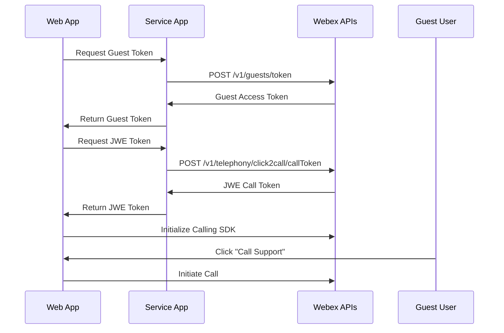

# Webex JavaScript SDK Click-to-Call Demo

A comprehensive demonstration of implementing click-to-call functionality using the Webex JavaScript SDK. This interactive travel booking application showcases how to integrate voice calling capabilities into web applications, featuring guest calling, call management, and real-time audio handling.

## 🎯 Features

This sample demonstrates advanced Webex Calling SDK integration with real-world use cases:

* **Click-to-Call Integration** - Seamless calling from web applications
* **Guest Calling** - Enable calls without Webex accounts using JWE tokens
* **Service App Authentication** - Secure token-based authentication flow
* **Call Management** - Mute, hold, transfer, and call control features
* **Call History** - Recent call tracking and management
* **Real-time Audio** - WebRTC-based audio streaming and controls
* **Travel Booking UI** - Professional interface demonstrating business context

## 📚 Prerequisites

### Software Requirements

- **Modern Web Browser** with WebRTC support (Chrome, Firefox, Safari, Edge)
- **Node.js and npm** for package management
- **Local web server** (included via http-server)

### Webex Developer Account

- **[Webex Developer Account](https://developer.webex.com/)** - Sign up for free
- **Service App** configured for Click-to-Call functionality
- **Webex Calling License** for the organization

### Service App Configuration

Your Service App must be configured with:
- **Click-to-Call permissions** for guest calling
- **Guest token generation** capabilities
- **Calling API access** for authentication

## 🚀 Quick Start

### Setup Instructions

1. **Clone the repository**:
   ```bash
   git clone <repository-url>
   cd webex-js-sdk-calling-demo
   ```

2. **Install dependencies**:
   ```bash
   yarn install
   ```

3. **Configure authentication** in `js/app.js`:
   ```javascript
   // Update these variables with your Service App credentials
   let service_app_token = 'your_service_app_access_token_here';
   
   // In getJweToken() function, update:
   const payload = JSON.stringify({
     "calledNumber": "your_destination_number", // Call queue/hunt group number
     "guestName": "Guest User Name"
   });
   ```

4. **Start the development server**:
   ```bash
   yarn start
   ```

5. **Access the application**:
   - Navigate to [http://127.0.0.1:9000](http://127.0.0.1:9000)
   - Go to "My Trips" to start the click-to-call setup
   - Wait for green circle icon next to Harvey's avatar (indicates Webex Calling registration)
   - Click "Call Support" to place a call

## 📁 Project Structure

```
webex-js-sdk-calling-demo/
├── index.html              # Main landing page
├── mytrips.html            # Travel booking interface with calling
├── agent.html              # Agent dashboard (if applicable)
├── js/
│   ├── app.js              # Main application logic and authentication
│   ├── timer.js            # Call timer functionality
│   └── *.js                # Additional JavaScript utilities
├── sdk/
│   ├── calling-sdk.js      # Webex Calling SDK integration
│   └── demo.js             # Demo-specific functionality
├── controls/               # Call control components
│   ├── controls.html       # Call control interface
│   ├── controls.css        # Call control styling
│   └── controls.js         # Call control logic
├── css/                    # Styling and themes
├── images/                 # Application assets
├── fonts/                  # Typography resources
├── package.json            # Dependencies and scripts
└── README.md               # This file
```

## 🔧 Functionality Overview

### Core Features

| Feature | Description | Implementation |
|---------|-------------|----------------|
| **Guest Authentication** | Generate guest tokens for calling | `getGuestToken()` function |
| **JWE Token Generation** | Create click-to-call tokens | `getJweToken()` function |
| **Call Initiation** | Start calls from web interface | `initiateCall()` function |
| **Call Controls** | Mute, hold, transfer operations | Call control buttons |
| **Call History** | View recent call records | `renderCallHistory()` function |
| **Real-time Audio** | WebRTC audio stream handling | Audio element management |

### Authentication Flow



## 🔐 Authentication Implementation

### Guest Token Generation

```javascript
async function getGuestToken() {
  const myHeaders = new Headers();
  myHeaders.append("Content-Type", "application/json");
  myHeaders.append("Authorization", `Bearer ${service_app_token}`);

  const raw = JSON.stringify({
    "subject": "Webex Click To Call Demo",
    "displayName": "WebexOne Demo"
  });

  const response = await fetch("https://webexapis.com/v1/guests/token", {
    method: "POST",
    headers: myHeaders,
    body: raw
  });
  
  const data = await response.json();
  return data.accessToken;
}
```

### JWE Token for Click-to-Call

```javascript
async function getJweToken() {
  const myHeaders = new Headers();
  myHeaders.append("Authorization", `Bearer ${service_app_token}`);

  const payload = JSON.stringify({
    "calledNumber": "your_destination_number",
    "guestName": "Guest User"
  });

  const response = await fetch("https://webexapis.com/v1/telephony/click2call/callToken", {
    method: "POST",
    headers: myHeaders,
    body: payload
  });

  const result = await response.json();
  return result.callToken;
}
```

### Webex SDK Configuration

```javascript
async function getWebexConfig(userType) {
  const guestToken = await getGuestToken();
  
  return {
    config: {
      logger: { level: "debug" },
      meetings: {
        reconnection: { enabled: true },
        enableRtx: true
      },
      encryption: {
        kmsInitialTimeout: 8000,
        kmsMaxTimeout: 40000,
        batcherMaxCalls: 30
      }
    },
    credentials: {
      access_token: guestToken
    }
  };
}
```

## 📡 Calling SDK Integration

### SDK Initialization

```javascript
async function initCalling(userType) {
    const webexConfig = await getWebexConfig(userType);
    const callingConfig = await getCallingConfig();

    // Initialize Calling SDK
    calling = await Calling.init({ webexConfig, callingConfig });
    
    calling.on("ready", () => {
        calling.register().then(async () => {
            callingClient = calling.callingClient;
            line = Object.values(callingClient?.getLines())[0];
            
            setupLineListeners();
            line.register();
        });
    });
}
```

### Line Registration and Event Handling

```javascript
function setupLineListeners() {
    line.on('registered', (lineInfo) => {    
        line = lineInfo;
        updateAvailability(); // Show green circle indicator
    });

    // Handle incoming calls
    line.on('line:incoming_call', (callObj) => {
        openCallNotification(callObj);
        incomingCall = callObj;
    });
}
```

### Call Management

```javascript
// Initiate outbound call
async function initiateCall() {
    try {
        const destination = "destination_number";
        call = line.makeCall({
            type: 'uri',
            address: destination
        });
        
        setupCallListeners(call);
        await call.dial();
    } catch (error) {
        console.error('Call initiation failed:', error);
    }
}

// Call control functions
function toggleMute() {
    if (call) {
        call.isMuted() ? call.unmute() : call.mute();
        callNotification.muteToggle();
    }
}

function toggleHold() {
    if (call) {
        call.isHeld() ? call.resume() : call.hold();
        callNotification.holdToggle();
    }
}
```

## 🎨 User Interface Components

### Travel Booking Interface

The application presents a realistic travel booking scenario:

- **Homepage**: Travel destination showcase with navigation
- **My Trips**: Booking management interface with call support
- **Call Controls**: In-call management overlay
- **Call History**: Recent call tracking and management

### Call Notification System

```html
<div class="incoming-call-notification timestate" id="callNotification">
    <div class="notifier-a">
        <div class="call-avatar">C</div>
        <div class="call-info">
            <div class="callee-name">Customer Care</div>
        </div>
        <div class="call-time" id="call-time">
            <span id="timer">00:01</span>
            <span class="blink_me" id="hold-status">On Hold</span>
        </div>
        <div class="call-actions">
            <button class="cut-call-btn" onclick="disconnectCall()">
                <i class="fa fa-times"></i>
            </button>
        </div>
    </div>
    <div class="notifier-a-controls">
        <button class="mute tooltip-trigger" data-tooltip="Mute" onclick="toggleMute()">
            <i class="fa fa-microphone-slash"></i>
        </button>
    </div>
</div>
```

### Call Control Features

- **Mute/Unmute**: Toggle microphone state
- **Hold/Resume**: Put calls on hold
- **Call Timer**: Track call duration
- **Visual Indicators**: Connection status and availability
- **Tooltips**: User-friendly control descriptions

## 🔧 Configuration Options

### Service App Configuration

| Setting | Description | Example |
|---------|-------------|---------|
| `service_app_token` | Service App access token | `Bearer eyJ0eXAiOiJKV1Q...` |
| `calledNumber` | Destination number for calls | `+1234567890` |
| `guestName` | Display name for guest users | `"Customer Support Guest"` |

### Calling Configuration

```javascript
async function getCallingConfig() {
    const jweToken = await getJweToken();
    
    return {
        clientConfig: {
            calling: true,
            callHistory: true
        },
        callingClientConfig: {
            logger: { level: "info" },
            discovery: {
                region: "US-EAST",
                country: "US"
            },
            serviceData: { 
                indicator: 'guestcalling', 
                domain: '', 
                guestName: 'Harvey'
            },
            jwe: jweToken
        },
        logger: { level: "info" }
    };
}
```

## 🌐 Production Considerations

### Security Best Practices

1. **Token Management**: Store service app tokens securely
   ```javascript
   // Use environment variables or secure storage
   const service_app_token = process.env.WEBEX_SERVICE_APP_TOKEN;
   ```

2. **HTTPS Requirement**: Ensure HTTPS for WebRTC functionality
3. **Input Validation**: Validate all user inputs and phone numbers
4. **Rate Limiting**: Implement calling rate limits

### Performance Optimization

```javascript
// Lazy load SDK components
const loadCallingSDK = async () => {
    if (!window.Calling) {
        await import('https://unpkg.com/webex@3.5.0-next.25/umd/calling.min.js');
    }
    return window.Calling;
};
```

### Error Handling

```javascript
async function initCalling(userType) {
    try {
        calling = await Calling.init({ webexConfig, callingConfig });
    } catch (error) {
        console.error('Calling initialization failed:', error);
        // Implement user-friendly error messaging
        showErrorMessage('Unable to initialize calling. Please try again.');
    }
}
```

## 🔧 Development

### Local Development Setup

1. **Install dependencies**:
   ```bash
   yarn install
   ```

2. **Start development server**:
   ```bash
   yarn start
   ```

3. **Development with debugging**:
   ```javascript
   // Enable debug logging
   const webexConfig = {
       config: {
           logger: { level: "debug" }
       }
   };
   ```

### Testing the Integration

1. **Verify Service App token**: Ensure valid access token
2. **Check call destination**: Confirm destination number is reachable
3. **Test browser compatibility**: Verify WebRTC support
4. **Monitor console logs**: Check for SDK initialization errors
5. **Test call controls**: Verify mute, hold, and disconnect functions

### Extending Functionality

Example: Adding video calling support:

```javascript
// Enable video in calling config
const callingConfig = {
    clientConfig: {
        calling: true,
        video: true,  // Enable video calling
        callHistory: true
    }
};

// Handle video streams
call.on('media:local_video', (stream) => {
    document.getElementById('local-video').srcObject = stream;
});

call.on('media:remote_video', (stream) => {
    document.getElementById('remote-video').srcObject = stream;
});
```

## 🔗 Related Resources

### Webex Calling SDK Documentation
- [Webex Web Calling SDK Introduction](https://github.com/webex/webex-js-sdk/wiki/Introducing-the-Webex-Web-Calling-SDK)
- [Core Calling Concepts](https://github.com/webex/webex-js-sdk/wiki/Core-Concepts-(Calling))
- [Calling Quickstart Guide](https://github.com/webex/webex-js-sdk/wiki/Quickstart-Guide-(Calling))
- [Authorization Guide](https://github.com/webex/webex-js-sdk/wiki/Authorization-(Calling))

### Advanced Features
- [Background Noise Removal](https://github.com/webex/webex-js-sdk/wiki/Webex-Calling-%7C-Background-Noise-Removal)
- [Supplementary Services](https://github.com/webex/webex-js-sdk/wiki/Calling-Supplementary-Services)
- [Voicemail Integration](https://github.com/webex/webex-js-sdk/wiki/Voicemail)
- [Contacts Management](https://github.com/webex/webex-js-sdk/wiki/Contacts)
- [Call History](https://github.com/webex/webex-js-sdk/wiki/Calling-Call-History)
- [Call Settings](https://github.com/webex/webex-js-sdk/wiki/Call-Settings)

### Developer Resources
- [Webex Developer Portal](https://developer.webex.com/)
- [GitHub Wiki](https://github.com/webex/webex-js-sdk/wiki)
- [SDK GitHub Repository](https://github.com/webex/webex-js-sdk)

## 🆘 Support

### Community Support
- **Webex SDK Contributors**: [https://eurl.io/#v-LbYXL27](https://eurl.io/#v-LbYXL27)
- **Chrome Extension Support**: [https://eurl.io/#YbnG_BwcN](https://eurl.io/#YbnG_BwcN)

### Developer Support
- [Developer Support Portal](https://developer.webex.com/support)
- [Developer Community](https://community.cisco.com/t5/webex-for-developers/bd-p/disc-webex-developers)
- [GitHub Repository Issues](https://github.com/webex/webex-js-sdk/issues)
- **Email**: devsupport@webex.com

### Beta Program
- [Webex Developers Beta Program](https://gobeta.webex.com/key/dev-platform)

### Feature Requests
- [Cisco Collaboration Ideas](https://ciscocollaboration.ideas.aha.io/)

## 🤝 Contributing

1. Fork the repository
2. Create a feature branch
3. Make your changes
4. Test thoroughly with real calling scenarios
5. Submit a pull request

## 📄 License

This project is licensed under the **Cisco Sample Code License**.

### License Summary

- ✅ **Permitted**: Copy, modify, and redistribute for use with Cisco products
- ❌ **Prohibited**: Use independent of Cisco products or to compete with Cisco
- ℹ️ **Warranty**: Provided "as is" without warranty
- ℹ️ **Support**: Not supported by Cisco TAC

See the [LICENSE](LICENSE) file for full license terms.

---

**Ready to integrate click-to-call with Webex!** 🚀📞
